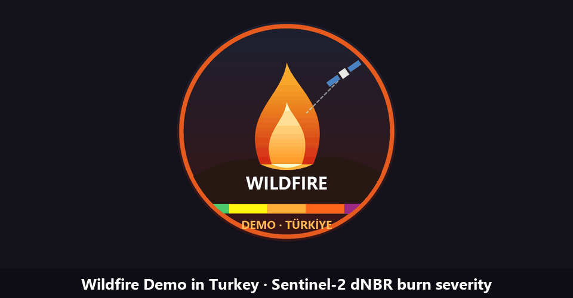

# Wildfire Demo in Turkey

Google Earth Engine app that maps burn scars and burn severity (dNBR) from Sentinel-2 imagery for major Turkish wildfires, or for any area a user draws.

**Live app:** https://potent-catwalk-418623.projects.earthengine.app/view/wildfire-demo-turkey

## What it does

- **Preset fires:** İzmir Karabağlar/Menderes (Aug 2019), Antalya Manavgat (Jul–Aug 2021), Muğla Marmaris (Aug 2021), plus a custom area drawn on the map.
- **Before/after swipe map:** true colour, SWIR false colour, dNBR and burn severity, switchable on each side from the sidebar.
- **Statistics:** images used, analysed area, burned area (dNBR ≥ 0.1), area per severity class and mean dNBR.
- **NBR time series:** the drop marks the fire date.
- **Download:** the burn severity map as a GeoTIFF.

## Method

| Step | Detail |
|---|---|
| Imagery | `COPERNICUS/S2_HARMONIZED` (L1C) for composites, `COPERNICUS/S2_SR_HARMONIZED` (L2A) for the time series |
| Cloud mask | `QA60` bits 10–11, or `MSK_CLASSI_OPAQUE` / `MSK_CLASSI_CIRRUS` on reprocessed scenes; SCL for L2A |
| Index | NBR = (B8 − B12) / (B8 + B12), median composites before and after the fire date |
| Change | dNBR = NBRpre − NBRpost; water masked with ESA WorldCover (class 80) |
| Severity | USGS classes (Key & Benson, 2006), thresholds −0.25, −0.1, 0.1, 0.27, 0.44, 0.66: high regrowth, low regrowth, unburned, low, moderate-low, moderate-high, high |

Results are indicative and are not an official damage assessment.

## Files

| File | Purpose |
|---|---|
| `wildfire_demo_turkey_app.js` | The published app (no imports needed) |
| `burn_analysis_revised.js` | Original single-fire script with supervised classification; needs `soil`, `tree`, `burned` training imports with an `LC` property (1/2/3) |
| `wildfire_demo_turkey_logo.png` | App logo, 512×512 |
| `demo.gif` | Walkthrough built from app screenshots |

## Updating the app

1. Open the Earth Engine Code Editor and paste `wildfire_demo_turkey_app.js`.
2. Press **Run** and check it works.
3. Open **Apps**, click the app ID `wildfire-demo-turkey` and choose **Update**, using the current editor contents.

The app runs under the Cloud project `potent-catwalk-418623`. The Earth Engine API must be enabled on that project and the project registered for Earth Engine, or the app fails with "Earth Engine API has not been used in project…".

## Related material

- [Damage assessment report](https://docs.google.com/presentation/d/1hSkAXeVTCdGlBS-cIAx_8_CG9ws9yU8z/edit?usp=sharing)
- [Presentation](https://docs.google.com/presentation/d/1TOlM-iM_FuItR8aL7_iNC8xZgPU6nNxO/edit?usp=sharing)
- Portfolio card on [ergin.ca](https://ergin.ca) ([ergin-portfolio](https://github.com/ergincagataycankaya/ergin-portfolio))

## Data

Contains modified Copernicus Sentinel-2 data (ESA), processed in Google Earth Engine. ESA WorldCover 10 m v200.
